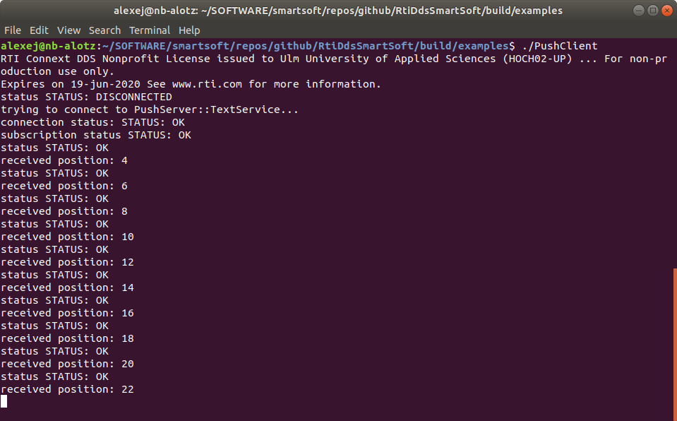

# RTI-DDS/SmartSoft

This repository provides the implementation of the **RTI-DDS/SmartSoft** framework. The **RTI-DDS/SmartSoft** framework implements the **[SmartSoft Component-Developer API](https://github.com/Servicerobotics-Ulm/SmartSoftComponentDeveloperAPIcpp)** based on the **[RTI Connext DDS](https://www.rti.com/products/connext-dds-professional)** middleware.

## Installation instructions

The **RTI-DDS/SmartSoft Framework** has two main dependencies, the **[SmartSoft Component-Developer API](https://github.com/Servicerobotics-Ulm/SmartSoftComponentDeveloperAPIcpp)** (see instructions below), and the **[RTI Connext DDS](https://www.rti.com/products/connext-dds-professional)** (min. version **6.0.1**) middleware. For the installation of the **RTI Connext DDS** library we recommend to read the **[Getting Started Guide (PDF)]( https://community.rti.com/static/documentation/connext-dds/6.0.1/doc/manuals/connext_dds/RTI_ConnextDDS_CoreLibraries_GettingStarted.pdf)**.

Further dependencies:

  * **[CMake](https://cmake.org/)** min. version **3.5**
  * C++ compiler supporting the **C++ 11** standard
  * optional: [Google Test](https://github.com/google/googletest) (for optionally executing the included tests)

At the moment, RTI-DDS/SmartSoft has been extensively tested with the Ubuntu 18.04 64bit Linux operating system, however, the library by itself is independent of any specific operating system. If you are using Ubuntu Linux, we recommend to install the necessary build essentials:

```bash
> sudo apt-get install build-essential pkg-config cmake
```

Please follow the additional installation instructions in the followup sections.

### Cloning and Building the SmartSoft Component-Developer API

For cloning and building the SmartSoft Component-Developer API, please follow the instructions in the next code block below. Please note that the default installation folder is assumed to be defined over the environment variable named **SMART_ROOT_ACE** and the best practice for the clone location is **$SMART_ROOT_ACE/repos**.

```bash
> export SMART_ROOT_ACE=~/SOFTWARE/smartsoft
> mkdir -p $SMART_ROOT_ACE/repos
> cd $SMART_ROOT_ACE/repos
> git clone https://github.com/Servicerobotics-Ulm/SmartSoftComponentDeveloperAPIcpp.git
> cd SmartSoftComponentDeveloperAPIcpp
> mkdir build
> cd build
> cmake ..
> make install
```

Now the RTI-DDS/SmartSoft Framework can be compiled as shown in the following section.

### Compiling the RTI-DDS/SmartSoft

For compiling the RTI-DDS/SmartSoft it is assumed that the RTI Connext DDS middleware has been installed (you can get it from [www.rti.com](www.rti.com)) and that CMake (at least version 3.5) as well as a C++ compiler supporting the C++ Standard 11 are preinstalled. At the moment, **Ubuntu 18.04 64bit** is the mostly tested and used operating system.

First, checkout a copy of the RTI-DDS/SmartSoft github repository into any location of your choice, for example like this:

```bash
> mkdir -p ~/SOFTWARE/smartsoft/repos
> cd ~/SOFTWARE/smartsoft/repos
> git clone https://github.com/Servicerobotics-Ulm/RTI-DDS-SmartSoft.git
```

Next, select a location where all the locally compiled binaries, libraries, headers and all other files should be installed. For instance, this can be the location **~/SOFTWARE/smartsoft**. This location should be specified using the environment variable called **SMART_ROOT_ACE** (use .profile to make this variable persistent). Overall, you can build and install RTI-DDS/SmartSoft like this:

```bash
> cd ~/SOFTWARE/smartsoft
> echo "export SMART_ROOT_ACE=$PWD" > ~/.profile
> source ~/.profile
> cd $SMART_ROOT_ACE/repos/RTI-DDS-SmartSoft
> mkdir -p build
> cd build
> cmake ..
> make
```

That should fully build the RTI-DDS/SmartSoft framework inclusing the examples. In case if you also optionally have installed the Google Test library, the provided tests will be automatically built as well.

Please note, that components will need to find the installed libraries at startup using the **LD_LIBRARY_PATH** environment variable which can be set as follows (you only need to do this once, if not already done):

```bash
> echo "export LD_LIBRARY_PATH=$LD_LIBRARY_PATH:$SMART_ROOT_ACE/lib" > ~/.bashrc
> bash
```

### Trying out the shipped example components

This library comes with several simple example components located in the subfolder named **examples**. The example components are automatically built together with the core library.

For instance, to execute the two Push-Pattern example components, open two new Terminal windows.

In the first terminal, we will start the **PushServer** component as follows:

```bash
> cd $SMART_ROOT_ACE/repos/RtiDdsSmartSoft
> cd build/examples
> ./PushServer
```

In the second terminal, we will start the **PushClient** component as follows:

```bash
> cd $SMART_ROOT_ACE/repos/RtiDdsSmartSoft
> cd build/examples
> ./PushClient
```

Now you should be able to see the client receiving every second update from the server as shown in the screenshot:



You can stop the components by pressing **CTRL+C** in each terminal window.

Enjoy!
